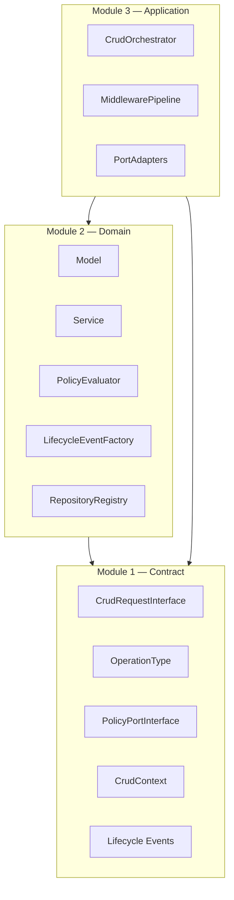
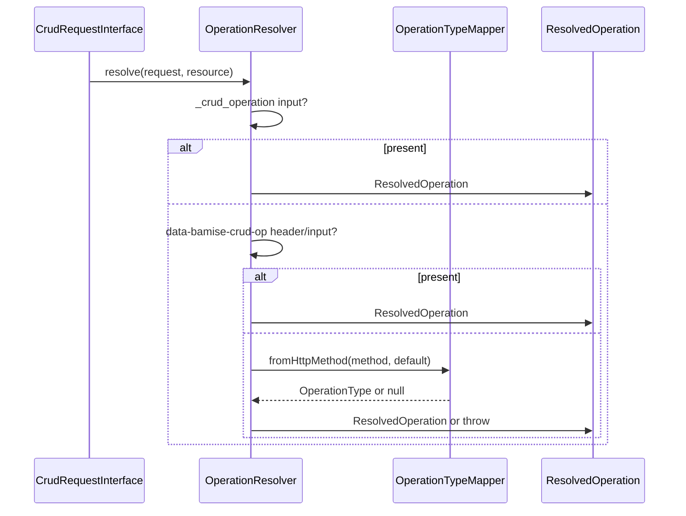

# Module 2 — Domain

The domain module holds business rules and pure domain logic for Bamise. It depends only on `Bamise\Contract\` — never on infrastructure, HTTP frameworks, or PDO.

## Layout

```
src/Domain/
├── Model/           # Domain value objects and thin models
├── Service/         # Pure domain services (constructor DI)
├── Policy/          # Policy port coordination
├── Event/           # Lifecycle event factory
├── Exception/       # Domain-specific exceptions
└── Repository/      # Logical repository name registry
```

## Dependency rules



| Rule | Detail |
|------|--------|
| Allowed imports | `Bamise\Contract\*` only |
| Forbidden | `Bamise\Infrastructure\*`, PDO, framework HTTP types |
| DI style | Constructor injection on services; no facades or static mutable state |
| Exceptions | Prefer Contract exceptions for cross-cutting cases; domain adds `MassAssignmentException`, `InsufficientPermissionException` |

## Models

| Class | Responsibility |
|-------|----------------|
| `Resource` | Resource name, physical table, primary key column |
| `ResolvedOperation` | Resolved `OperationType`, `Resource`, optional `ResourceId` |
| `Subject` | Authenticated identity: id, roles, explicit permission strings |
| `Permission` | `resource` + `action`; factory `fromString('users.create')` |
| `FieldBag` | Immutable sanitized input field bag |

## Services

### `OperationResolver`

Resolves the effective CRUD operation from a `CrudRequestInterface` and `Resource` using **fail-closed** waterfall priority:

1. `_crud_operation` request input
2. `data-bamise-crud-op` HTTP header, then same key in input (header and input must agree if both present)
3. HTTP method via `OperationTypeMapper` (POST→Create, GET→Read, PUT/PATCH→Update, DELETE→Delete), with optional default override for non-standard methods

Throws `OperationResolutionException` on invalid enum values, conflicting overrides, or unmappable methods.

### `OperationTypeMapper`

Maps HTTP verbs and string hints to `OperationType`.

### `PermissionEvaluator`

Evaluates explicit permission strings on `Subject` (`isGranted`). Does **not** call `PolicyPortInterface` — row-level and policy-class rules belong to application/infrastructure wiring.

### `FillableGuard`

Enforces fillable/guarded lists from resource definitions. **Guarded** fields are stripped silently. **Non-fillable** fields (when a fillable list is defined) throw `MassAssignmentException` rather than `ValidationException`, to distinguish write-shape policy from rule validation.

## Policy

`PolicyEvaluator` is a thin adapter: maps action string → `OperationType` and delegates to `PolicyPortInterface::allows()`. Policy classes themselves are implemented outside the domain layer.

## Events

`LifecycleEventFactory` builds Contract lifecycle events (`BeforeCreate`, `AfterUpdate`, etc.) from `CrudContext`, keeping event construction out of infrastructure adapters.

## Repository registry

`RepositoryRegistry` maps resource names to logical repository keys (container/service ids). No database access — configuration only.

## Exceptions

| Class | Extends | When |
|-------|---------|------|
| `MassAssignmentException` | `BamiseException` | Fillable/guarded violation |
| `InsufficientPermissionException` | `BamiseException` | Explicit permission denial (application may throw) |
| `OperationResolutionException` | *(Contract)* | Ambiguous/invalid operation resolution |
| `AuthorizationException` | *(Contract)* | Policy/authorization failures at app layer |

## Operation resolution flow



## Tests

Lightweight unit tests under `tests/Unit/Domain/` use `FakeCrudRequest` in `tests/Fixtures/` to exercise resolution order, permissions, and fillable guarding without infrastructure.

## Next module — Application (Module 3)

**Module 3 — Application** (`src/Application/`) will add:

- CRUD orchestrator / pipeline composing middleware and strategies
- Port adapter facades wiring Contract ports to Infrastructure implementations
- `AuthPortInterface` → `Subject` mapping
- Resource definition registry loading `Resource` + fillable metadata into the pipeline
- Exception → HTTP response mapping
- Integration of `PolicyEvaluator`, `PermissionEvaluator`, `OperationResolver`, and `LifecycleEventFactory` in the request lifecycle

Infrastructure (Module 4+) implements PDO repositories, query builder SQL, CSRF, sanitizers, and concrete policy classes.
