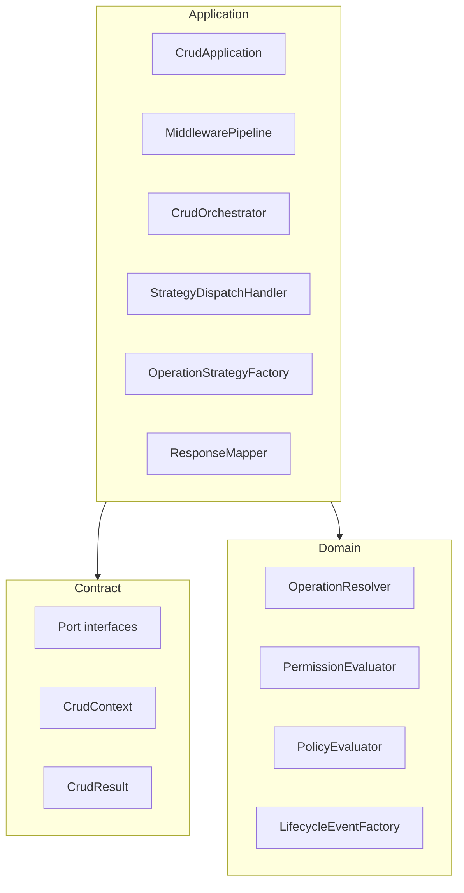
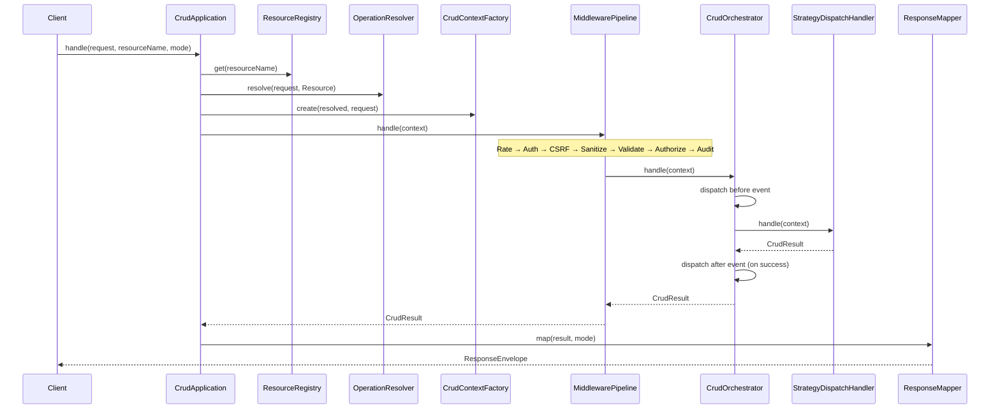

# Module 3 — Application

The application module orchestrates CRUD requests: resource resolution, middleware pipeline, strategy dispatch, lifecycle events, and HTTP-agnostic response envelopes. It depends only on `Bamise\Contract\` and `Bamise\Domain\`.

## Layout

```
src/Application/
├── CrudApplication.php       # Public entry point
├── DTO/                    # ResponseEnvelope
├── Registry/               # ResourceRegistry
├── Context/                # CrudContextFactory, SubjectFactory, PipelineState
├── Middleware/             # Pipeline + security/validation middleware
├── Handler/                # CrudOrchestrator, StrategyDispatchHandler
├── Strategy/               # OperationStrategyFactory + placeholder strategies
├── Response/               # ResponseMapper, ExceptionMapper
└── Config/                 # ApplicationConfig, MiddlewareConfig
```

## Dependency diagram



## PipelineState vs CrudContext

`CrudContext` (Contract) is immutable and is what `MiddlewareInterface::process()` receives.

`PipelineState` (Application) carries:

- Current `CrudContext`
- `ResolvedOperation`
- `ResourceDefinitionInterface`
- Optional domain `Subject`

Middleware **rebuilds** `CrudContext` via `CrudContextFactory` (`withSubject`, `withInputData`) before calling `$next`. `CrudApplication` builds initial `PipelineState`, then passes `fromState()` context into the pipeline.

## Middleware order

Default priorities (lower runs first) from `MiddlewareConfig::defaults()`:

| Priority | Middleware | Port / service |
|----------|------------|----------------|
| 100 | RateLimitMiddleware | RateLimiterPortInterface |
| 200 | AuthenticationMiddleware | AuthPortInterface → SubjectFactory |
| 300 | CsrfMiddleware | CsrfPortInterface (mutations only) |
| 400 | SanitizeMiddleware | SanitizerPortInterface |
| 500 | ValidateMiddleware | ValidatorPortInterface, FillableGuard |
| 600 | AuthorizeMiddleware | PermissionEvaluator, PolicyEvaluator |
| 900 | AuditMiddleware | AuditLoggerPortInterface (after success) |

Terminal handler chain:

`MiddlewarePipeline` → `CrudOrchestrator` (lifecycle events) → `StrategyDispatchHandler` → `OperationStrategyFactory` → placeholder strategy.

## handle() sequence



On exception, `ExceptionMapper` returns a failure `ResponseEnvelope` with an HTTP status hint.

## Placeholder strategies

`CreateStrategy`, `ReadStrategy`, `UpdateStrategy`, and `DeleteStrategy` accept `RepositoryInterface` for future wiring but return `CrudResult` failure (`Infrastructure not wired`). Module 4 will provide PDO repositories and real persistence.

## Ports

Application code imports `Bamise\Contract\*` only. See [`src/Port/README.md`](../../src/Port/README.md).

## Tests

`tests/Unit/Application/` uses fakes in `tests/Fixtures/` for port implementations.

## Next module

**Module 4 — Infrastructure**: PDO connection, repository implementations, CSRF/sanitizer/rate limiter concrete classes, policy class wiring, and strategy persistence.
