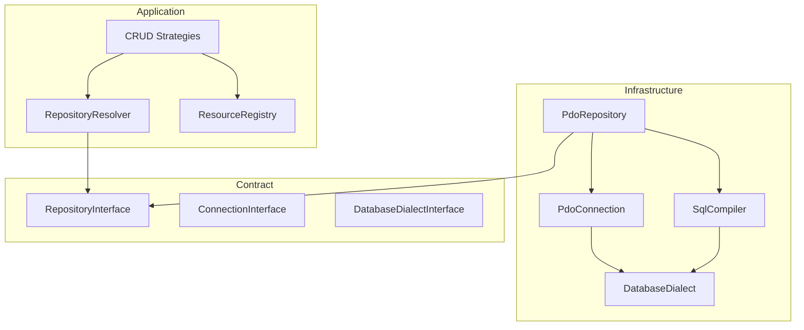

# Module 4 — Infrastructure (Persistence)

The infrastructure module implements persistence adapters for Bamise: PDO connections, SQL dialects, safe SQL compilation, and resource-scoped repositories. It depends on `Bamise\Contract\` only (not Application or Domain business services).

## Layout

```
src/Infrastructure/
├── Cache/
│   └── InMemoryCache.php
├── Event/                  # Module 9 — see 09-events.md
├── Queue/
│   └── InMemoryQueue.php
├── Plugin/
│   └── DefaultPluginRegistry.php
├── Security/               # Module 8 — see 08-security.md
│   ├── Csrf/
│   ├── Sanitizer/
│   ├── RateLimit/
│   ├── Signing/
│   ├── Policy/
│   ├── Auth/
│   ├── Audit/
│   └── SecurityFactory.php
└── Persistence/
    ├── PDO/
    │   ├── Dialect/          # Mysql, Postgres, Mariadb, Sqlite + factory
    │   ├── ConnectionConfig.php
    │   ├── PdoConnection.php
    │   └── ConnectionManager.php
    ├── Query/
    │   ├── SqlCompiler.php
    │   └── CompiledQuery.php
    └── Repository/
        ├── PdoRepository.php
        ├── PdoRepositoryFactory.php
        ├── ResourceMetadata.php
        └── InfrastructureRepositoryRegistry.php
```

Application wiring uses `Bamise\Application\Registry\RepositoryResolver` to map resource names to `RepositoryInterface` instances built by `InfrastructureRepositoryRegistry`.

## Layer diagram



## SQL safety rules

| Rule | Implementation |
|------|----------------|
| Prepared statements only | `PDO::prepare()` + `execute($bindings)` |
| Identifier quoting | `DatabaseDialectInterface::quoteIdentifier()` |
| Identifier whitelist | Table/column names from `ResourceDefinitionInterface` / fillable keys only |
| Value binding | All values use named placeholders (`:column`) |
| Write column filter | `SqlCompiler::whitelistColumns()` + `FillableGuard` in strategies |
| No dynamic SQL fragments | Compiler builds fixed statement shapes (INSERT/UPDATE/DELETE/SELECT BY ID) |

Identifiers must match `^[a-zA-Z_][a-zA-Z0-9_]*$` before quoting.

## Dialect support

| Driver | Class | Quote char | `supportsReturning()` |
|--------|-------|------------|------------------------|
| `mysql` | `MysqlDialect` | `` ` `` | false (uses `lastInsertId`) |
| `mariadb` | `MariadbDialect` | `` ` `` | false |
| `postgres` | `PostgresDialect` | `"` | true (`INSERT … RETURNING pk`) |
| `sqlite` | `SqliteDialect` | `"` | false (uses `lastInsertId`) |

`DialectFactory::fromDriver(DatabaseDriver)` selects the dialect implementation.

## Repository lifecycle

1. `ResourceMetadata::from($definition)` extracts table, primary key, fillable.
2. `PdoRepositoryFactory::for($definition)` builds a resource-scoped `PdoRepository`.
3. `InfrastructureRepositoryRegistry::register($resourceName, $definition)` stores repositories.
4. Composition root copies `all()` into `RepositoryResolver` for strategies.

## Transactions

`PdoConnection::transaction(callable $callback)` wraps PDO `beginTransaction` / `commit` / `rollBack`. Nested calls reuse the outer transaction when already active.

## Tests

| Path | Coverage |
|------|----------|
| `tests/Integration/Infrastructure/PdoRepositoryTest.php` | SQLite in-memory CRUD round-trip |
| `tests/Integration/Infrastructure/CreateStrategyIntegrationTest.php` | Application create strategy + real PDO |
| `tests/Fixtures/SqliteTestConnection.php` | Shared `:memory:` connection factory |
| `tests/Fixtures/TestUserResourceDefinition.php` | Sample resource metadata |

## Security (Module 8)

CSRF, sanitization, rate limiting, HMAC signing, policy adapters, auth, and audit logging live under `src/Infrastructure/Security/`. See [08-security.md](08-security.md).

## Out of scope (later modules)

- Fluent `QueryBuilderInterface` (Module 7)
- Queue production adapters
- CI/CD wiring

## Next module

**Module 7 — Query Builder** for fluent reads. Event system: [09-events.md](09-events.md).
