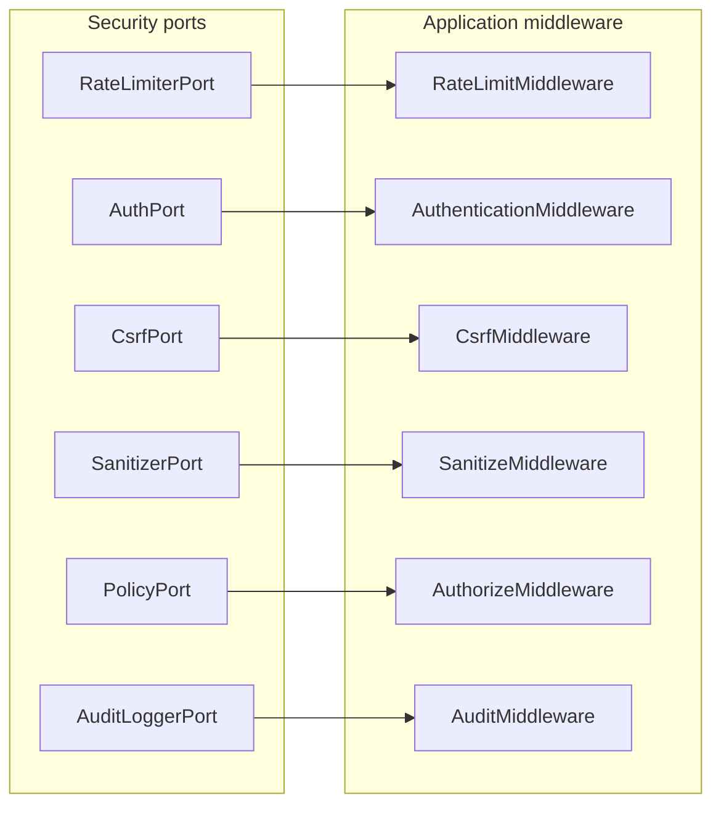

# Module 8 — Security (Infrastructure)

Security adapters implement `Bamise\Contract\Security\*` ports and related cross-cutting ports (`AuthPortInterface`, `AuditLoggerPortInterface`, `CachePortInterface`). Application middleware already consumes these contracts; this module supplies production-ready defaults with fail-closed behavior.

## Layout

```
src/Infrastructure/
├── Cache/
│   └── InMemoryCache.php
└── Security/
    ├── Csrf/
    ├── Sanitizer/
    ├── RateLimit/
    ├── Signing/
    ├── Policy/
    ├── Auth/
    ├── Audit/
    └── SecurityFactory.php
```

## Threat model

| Threat | Control | Port / middleware |
|--------|---------|-------------------|
| CSRF on mutations | Session-bound token, `hash_equals` | `SessionCsrfService` → `CsrfMiddleware` |
| XSS in input | Strip/allowlist tags, optional entity encoding | `HtmlSanitizer` → `SanitizeMiddleware` |
| Abuse / DoS | Fixed-window rate limit per key | `CacheRateLimiter` → `RateLimitMiddleware` |
| Replay / tampering (API) | HMAC + timestamp skew + nonce store | `HmacRequestSigner` (optional gateway) |
| Broken access control | Permissions + policies | `AuthorizeMiddleware` + `PolicyEvaluator` |
| Credential leakage in logs | Field redaction | `PsrAuditLogger` → `AuditMiddleware` |
| SQL injection | Parameter binding + identifier whitelist | Module 4 persistence (not this module) |

## Middleware mapping



Default pipeline order is defined in `MiddlewareConfig::defaults()` (see [03-application.md](03-application.md)).

## Authorization flow

`AuthorizeMiddleware` does **not** call `PolicyPortInterface` directly. It uses:

1. `PermissionEvaluator` — explicit permission strings on the domain `Subject` (e.g. `users.create`).
2. `PolicyEvaluator` — maps the operation string to `OperationType` and delegates to `PolicyPortInterface::allows()`.

Wire infrastructure policies into the domain layer:

```php
use Bamise\Domain\Policy\PolicyEvaluator;
use Bamise\Domain\Service\OperationTypeMapper;
use Bamise\Infrastructure\Security\Policy\ClassPolicyAdapter;
use Bamise\Infrastructure\Security\Policy\PolicyChain;
use Bamise\Infrastructure\Security\Policy\CallablePolicy;

$policyPort = new PolicyChain(
    new ClassPolicyAdapter($resourceDefinition->policyClasses()),
    new CallablePolicy(fn ($op, $subject, $resource) => $subject !== null),
);

$policyEvaluator = new PolicyEvaluator($policyPort, new OperationTypeMapper());
```

Resource policy classes may implement either:

- `Bamise\Infrastructure\Security\Policy\PolicyInterface` — `allows($subject, $action, $resource, $target)`
- `Bamise\Contract\Security\PolicyPortInterface` — `allows(OperationType, $subject, $resource)`

`ClassPolicyAdapter` AND-combines all classes from `ResourceDefinitionInterface::policyClasses()`.

## Configuration examples

```php
use Bamise\Infrastructure\Cache\InMemoryCache;
use Bamise\Infrastructure\Security\SecurityFactory;
use Bamise\Infrastructure\Security\Csrf\CsrfConfig;
use Bamise\Infrastructure\Security\RateLimit\RateLimitConfig;
use Bamise\Infrastructure\Security\Signing\SigningConfig;
use Bamise\Infrastructure\Security\Sanitizer\SanitizerConfig;

$cache = new InMemoryCache(); // use Redis/Memcached adapter in production
$factory = new SecurityFactory(
    cache: $cache,
    logger: $psrLogger,
    csrfConfig: new CsrfConfig(fieldName: '_csrf', ttlSeconds: 7200),
    sanitizerConfig: new SanitizerConfig(allowedTags: [], encodeEntities: true),
    rateLimitConfig: new RateLimitConfig(maxAttempts: 120, windowSeconds: 60),
    signingConfig: new SigningConfig(secret: getenv('BAMISE_SIGNING_SECRET') ?: ''),
);

$csrf = $factory->csrf();
$sanitizer = $factory->sanitizer();
$rateLimiter = $factory->rateLimiter();
$auditLogger = $factory->auditLogger();
$auth = $factory->bearerAuth(); // or sessionAuth() / jwtAuth($secret)
```

### CSRF (form mode)

- Generate: `$token = $csrf->generateForSession($sessionId);`
- Submit: `_session_id` + `_csrf` in request input (or `X-Session-Id` header).
- `CsrfMiddleware` calls `$csrf->validate($request)` on mutating operations.

### Rate limiting

`CacheRateLimiter::attempt($key)` returns `false` when exceeded; `RateLimitMiddleware` throws `RateLimitException`.

### Request signing (API gateways)

Canonical string (newline-separated):

```
METHOD
/path
{timestamp}
{nonce}
{sha256(json_body)}
```

Headers: `X-Bamise-Timestamp`, `X-Bamise-Nonce`, `X-Bamise-Signature`. Nonces are stored in cache to prevent replay.

### Auth adapters

| Adapter | Use case |
|---------|----------|
| `BearerTokenAuthAdapter` | Dev/test: `Authorization: Bearer {id}\|roles\|perms` |
| `SessionAuthAdapter` | Form tests: `_subject_id` in input |
| `JwtAuthAdapter` | Production JWT when `firebase/php-jwt` is installed (composer suggest) |

## CrudApplication wiring sketch

```php
$middleware = [
    new PrioritizedMiddleware(new RateLimitMiddleware($factory->rateLimiter()), 100),
    new PrioritizedMiddleware(new AuthenticationMiddleware($factory->bearerAuth(), $subjectFactory, $contextFactory), 200),
    new PrioritizedMiddleware(new CsrfMiddleware($factory->csrf()), 300),
    new PrioritizedMiddleware(new SanitizeMiddleware($factory->sanitizer(), $contextFactory), 400),
    // Validate, Authorize (PolicyEvaluator + permissions), Audit...
];
```

## Tests

| Path | Focus |
|------|--------|
| `tests/Unit/Infrastructure/Security/CsrfServiceTest.php` | Valid / invalid / expired token |
| `tests/Unit/Infrastructure/Security/HtmlSanitizerTest.php` | Script stripping |
| `tests/Unit/Infrastructure/Security/CacheRateLimiterTest.php` | Max attempts |
| `tests/Unit/Infrastructure/Security/HmacRequestSignerTest.php` | Signature, replay, skew |
| `tests/Unit/Infrastructure/Security/PolicyChainTest.php` | AND semantics |
| `tests/Integration/Infrastructure/Security/CsrfMiddlewareIntegrationTest.php` | Pipeline CSRF |

## Optional dependency

```json
"suggest": {
    "firebase/php-jwt": "^6.0 for JwtAuthAdapter HS256 validation"
}
```

## Next module

**Module 9 — Event system** (dispatcher adapters) or **Module 7 — Query Builder** for fluent reads.
