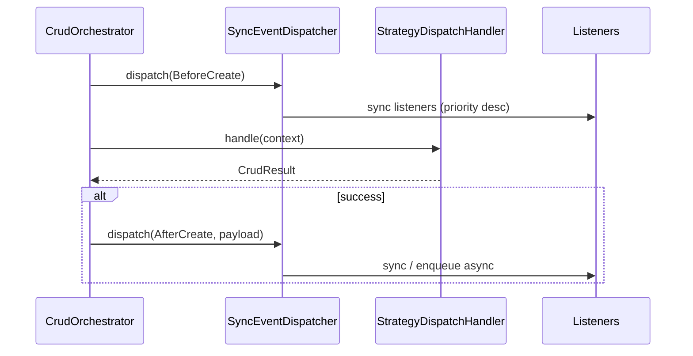

# Module 9 — Event system

Infrastructure adapters for `EventDispatcherPortInterface`: sync dispatch, optional async via `QueuePortInterface`, subscriber discovery, and plugin registration hooks.

## Layout

```
src/Infrastructure/
├── Event/
│   ├── ListenerRegistry.php
│   ├── PrioritizedListener.php
│   ├── SyncEventDispatcher.php
│   ├── InvokableListenerAdapter.php
│   ├── AsyncListenerRegistrar.php
│   ├── EventPayloadEncoder.php
│   ├── QueueJobPayload.php
│   ├── EventSubscriberInterface.php
│   ├── SubscriberLoader.php
│   └── Examples/
│       └── LogLifecycleSubscriber.php
├── Queue/
│   └── InMemoryQueue.php
└── Plugin/
    └── DefaultPluginRegistry.php
```

Contract lifecycle events live in `src/Contract/Event/`. `LifecycleEventFactory` (Domain) builds them from `CrudContext`.

## Lifecycle flow



Hook points (Application `CrudOrchestrator`):

| Phase | When | Event |
|-------|------|-------|
| Before | Before inner handler / repository | `BeforeCreate`, `BeforeUpdate`, `BeforeDelete` |
| After | After successful inner handler only | `AfterCreate`, `AfterUpdate`, `AfterDelete` |

Bulk update/delete use the same before/after update/delete event types.

## Sync dispatch

`SyncEventDispatcher` implements `EventDispatcherPortInterface`:

- `subscribe($eventClass, $listener, $priority)` — higher priority runs first (100 before 0).
- `dispatch($event)` — invokes listeners for the event class and, when the event implements `DomainEventInterface`, for each parent interface.
- **Stoppable propagation:** if a listener returns exactly `false`, remaining listeners for that dispatch are skipped.

```php
$registry = new ListenerRegistry();
$dispatcher = new SyncEventDispatcher($registry);

$dispatcher->subscribe(BeforeCreate::class, function (BeforeCreate $e): void {
    // validate, enrich context, etc.
}, priority: 50);

$dispatcher->dispatch($beforeCreateEvent);
```

## Async listeners

Register deferred listeners with `AsyncListenerRegistrar` (or `SyncEventDispatcher::subscribeAsync`). On dispatch, the listener is **not** invoked inline; a job is pushed to `QueuePortInterface`:

- Job name: `bamise.event.async_listener`
- Payload: encoded event metadata via `EventPayloadEncoder` (`event_class`, `operation`, `resource_name`, `input_data`, optional `payload`)

```php
$queue = new InMemoryQueue();
$dispatcher = new SyncEventDispatcher(new ListenerRegistry(), $queue);
$async = new AsyncListenerRegistrar($dispatcher);

$async->subscribe(AfterCreate::class, function (AfterCreate $e): void {
    // runs in queue worker (not implemented in this module)
});
```

`InMemoryQueue` is for tests and local wiring only.

## Subscribers

Implement `EventSubscriberInterface` and load with `SubscriberLoader`:

```php
final class LogLifecycleSubscriber implements EventSubscriberInterface
{
    public function getSubscribedEvents(): array
    {
        return [
            BeforeCreate::class => ['onLifecycle', 10],
            AfterCreate::class => 'onLifecycle',
        ];
    }

    public function onLifecycle(DomainEventInterface $event): void { /* ... */ }
}

(new SubscriberLoader())->load($dispatcher, new LogLifecycleSubscriber($logger));
```

Config values: method name string, or `[methodName, priority]`.

`InvokableListenerAdapter` wraps any object with `__invoke(object $event)` as a callable listener.

## Plugins

`DefaultPluginRegistry` implements `PluginRegistryInterface` and delegates `subscribe()` to the injected dispatcher. Plugins also register middleware, validation rules, and policy classes for host application wiring.

```php
$registry = new DefaultPluginRegistry($dispatcher);
$plugin->register($registry);
```

## Wiring with CRUD pipeline

Terminal handler chain (unchanged):

`MiddlewarePipeline` → `CrudOrchestrator` → `StrategyDispatchHandler` → strategies.

Inject `SyncEventDispatcher` (or a decorated dispatcher) wherever `EventDispatcherPortInterface` is required. Tests use `FakeEventDispatcherPort` or `SyncEventDispatcher` with `ListenerRegistry`.

## Tests

`tests/Unit/Infrastructure/Event/` — priority order, interface listeners, stoppable propagation, subscriber loader, async queue push, orchestrator before/after ordering.

## Next module

**Module 7 — Query Builder** (fluent reads) or **Module 10/11** — test expansion and CI/CD.
